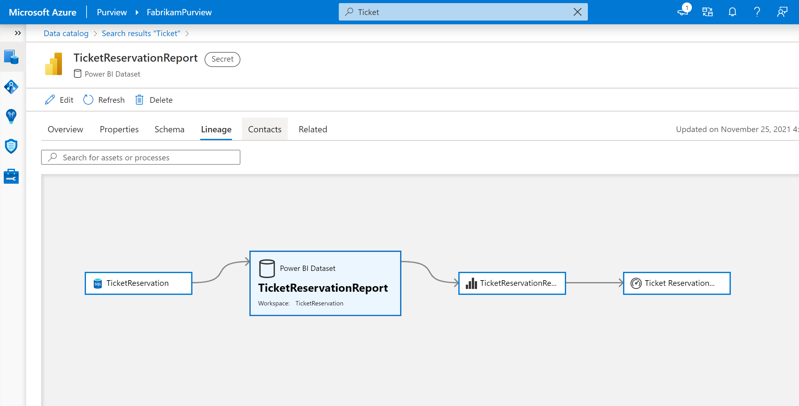
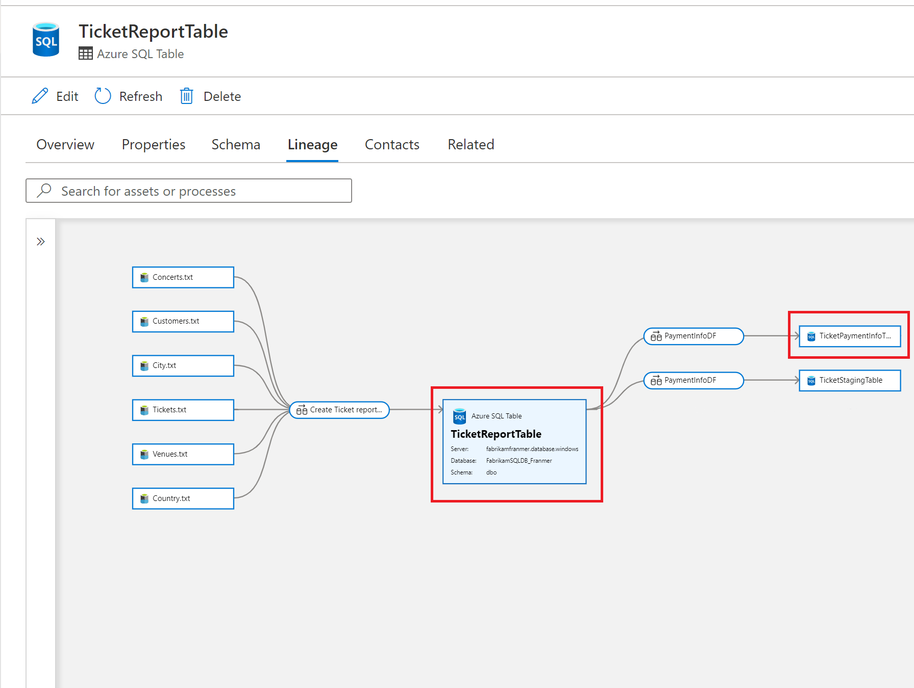
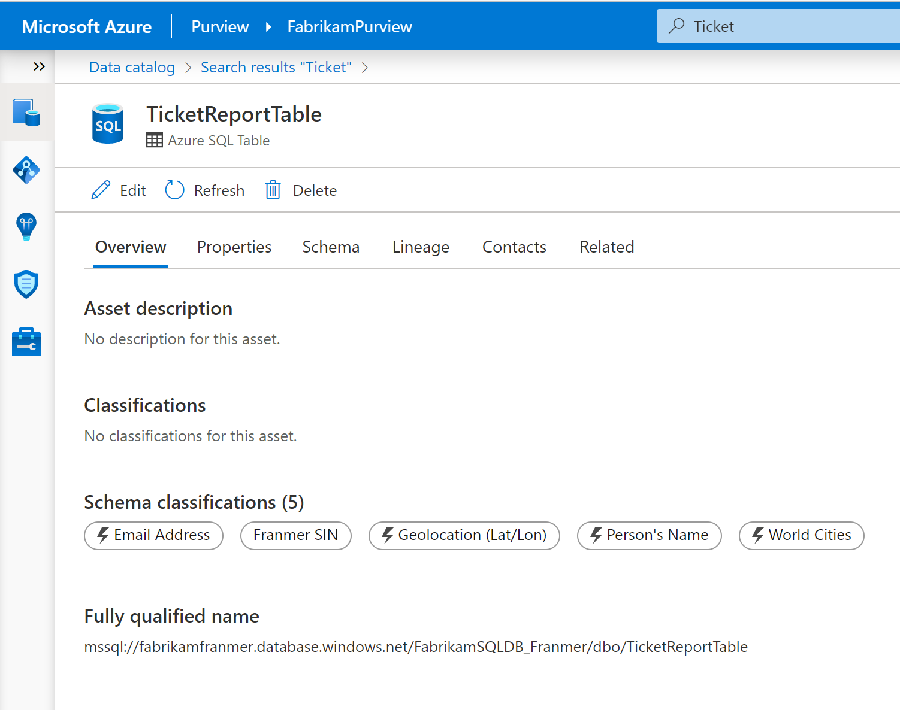
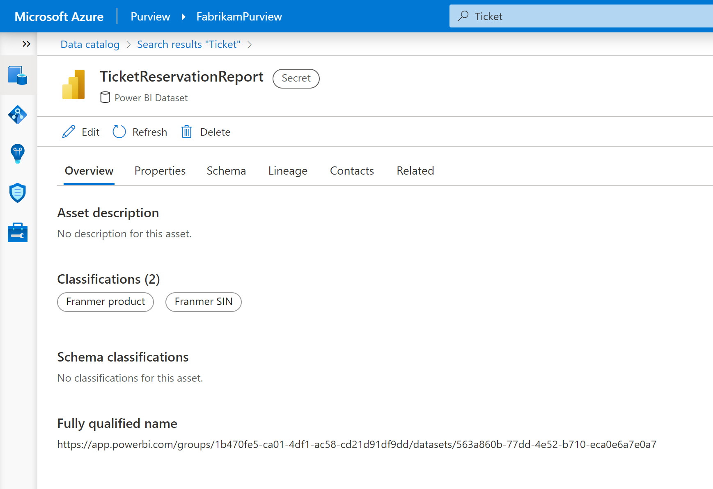
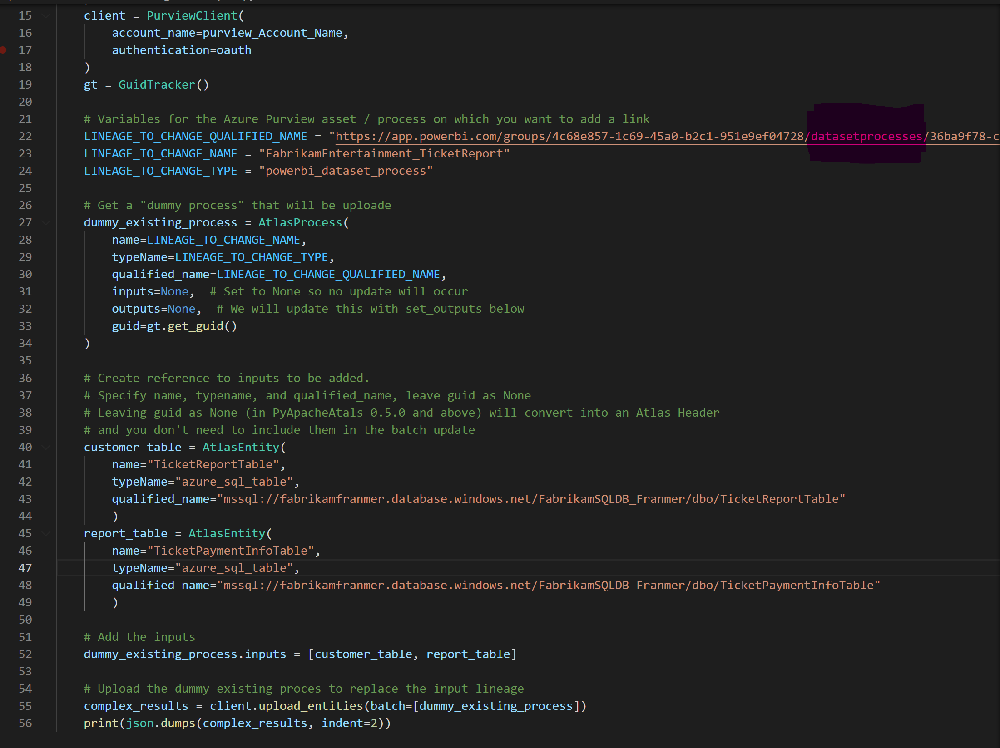

# Obtenir un linéage Power BI complet dans Azure Purview

Azure Purview possède un connecteur pour scanner les assets Power BI qui se trouvent aussi bien dans les espaces de travail personnel ou collaboratif. Azure Purview est aussi capable de récupérer le linéage existant dans Power BI service pour le rendre disponible au sein d'Azure Purview Studio. De plus Azure Purview possède aussi le lineage des autres assets qui servent parfois à la création des datasets de Power BI. Il manque cependant le lien entre ces deux linéages permettant d'avoir une vision globale des mouvements et transformations de données, de la source au tableau de bord Power BI pour obtenir une vision similaire à celle ci-dessous


Au passage, Merci à [Will Johnson](https://github.com/wjohnson) pour son aide !


## Pré requis


- Installer Python et pip (pip est généralement inclus dans l'installation de Python)
- Visual Studio Code (ou un autre éditeur de code)
- Installer PyApacheAtlas via pip
- Enregistrer une [application dans Azure Active Directory (AAD)](https://docs.microsoft.com/en-us/azure/active-directory/develop/quickstart-register-app)
- Ajouter cette application en tant que **"Data Curator"** au niveau de la collection **"Root"**. Plus de détails [ici](https://docs.microsoft.com/en-us/azure/purview/catalog-permissions)
- Avoir [scanner les sources de données](https://docs.microsoft.com/fr-fr/azure/purview/purview-connector-overview) adéquates (Stockage Azure, bases de données, Tenant Power BI,.....)
- Utiliser Azure Data Factory (ADF) our Azure Synapse Pipeline pour [capter les informations de linéage](https://docs.microsoft.com/en-us/azure/purview/catalog-lineage-user-guide)

## Scénario

Après avoir scanné nos sources de données, et si nos mouvements de données sont orchestrés soient via ADF ou Azure Synapse Pipeline, nous avons nativement 2 linéages :

Un linéage représentant les assets Power BI:


Un linéage qui part de la source, le lac de données, et qui termine dans une base de données Azure SQL Database comme illustré ci-dessous.
Le but pour moi, est de lier les 2 assets représentés en rouge au dataset Power BI pour compléter le linéage



## Le script

Pour compléter le linéage, nous allons utiliser le script python ci-dessous.

Mais avant, nous allons avoir besoins des informations suivantes :

- le **"Fuly qualified name"** de nos assets Azure SQL. Ci-dessous, un exemple pour un des assets Azure SQL :



Les informations du **"Fuly qualified name"** de l'asset Power BI. Et oui! Pour les datasets Power BI, il y a une feinte 😅. Dans le **"Fuly qualified name"**, il faut remplacer *datasets* par *datasetprocesses* !





Dans le script ci-dessous remplacer les valeurs en fonction de votre environnement. Pour la variable **name** ce n'est ni plus ni moins que le nom de l'asset (dans le cas illustré ici, je peux utiliser le nom *TicketReportTable*), même si vous pouvez mettre le nom que vous souhaitez.


```Javascript
import json
import os
from pyapacheatlas.auth import ServicePrincipalAuthentication
from pyapacheatlas.core import PurviewClient, AtlasEntity, AtlasProcess
from pyapacheatlas.core.util import GuidTracker

if __name__ == "__main__":
    purview_Account_Name = "<YourAzurePurviewAccountName>"
    oauth = ServicePrincipalAuthentication(
        client_id="<Your Client ID>",
        tenant_id="<Your Tenant ID>",    
        client_secret="<Your Secret>"
    )
    client = PurviewClient(
        account_name=purview_Account_Name,
        authentication=oauth
    )
    gt = GuidTracker()
    
    # Variables for the Azure Purview asset / process on which you want to add a link    
    LINEAGE_TO_CHANGE_QUALIFIED_NAME = "https://app.powerbi.com/groups/<YOUR GROUP ID>/datasetprocesses/<YOUR DATASET ID>"    
    LINEAGE_TO_CHANGE_NAME = "FabrikamEntertainment_TicketReport"    
    LINEAGE_TO_CHANGE_TYPE = "powerbi_dataset_process"    
    
    # Get a "dummy process" that will be uploade    
    dummy_existing_process = AtlasProcess(
        name=LINEAGE_TO_CHANGE_NAME,
        typeName=LINEAGE_TO_CHANGE_TYPE,
        qualified_name=LINEAGE_TO_CHANGE_QUALIFIED_NAME,
        inputs=None,  # Set to None so no update will occur        
        outputs=None,  # We will update this with set_outputs below        
        guid=gt.get_guid()
    )
    
    # Create reference to inputs to be added. 
    # Specify name, typename, and qualified_name, leave guid as None    
    # Leaving guid as None (in PyApacheAtals 0.5.0 and above) will convert into an Atlas Header    
    # and you don't need to include them in the batch update        
    customer_table = AtlasEntity(
        name="<YOUR ASSET NAME>",
        typeName="azure_sql_table",
        qualified_name="<YOUR FULY QUALIFIED NAME>"    
        )
    report_table = AtlasEntity(
        name="<YOUR ASSET NAME>",
        typeName="azure_sql_table",
        qualified_name="<YOUR FULY QUALIFIED NAME>"    
        )
    
    # Add the inputs    
    dummy_existing_process.inputs = [customer_table, report_table]
    
    # Upload the dummy existing proces to replace the input lineage    
    complex_results = client.upload_entities(batch=[dummy_existing_process])
    print(json.dumps(complex_results, indent=2))
```

Ci-dessous une copie d'écran de mon script dans Visual Studio Code :



Après exécution du code, vous deviez un beau linéage complet comme illustré ci-dessous :


Une courte vidéo est disponible [ici](https://github.com/franmer2/AzurePurviewFullPBILineage/tree/main/Video)
