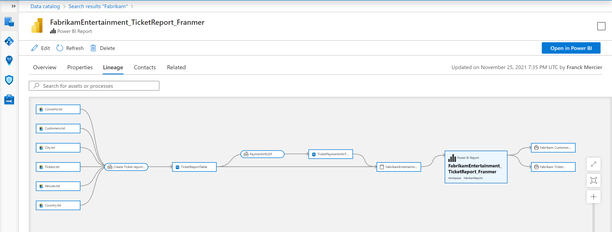

# Obtenir un lineage Power BI complet dans Azure Purview

Azure Purview possède un connecteur pour scanner les assets Power BI qui se trouvent aussi bien dans les espaces de travail personnel ou collaboratif. Azure Purview est aussi capable de récupérer le linéage existant dans Power BI service pour le rendre disponible au sein d'Azure Purview Studio. De plus Azure Purview possède aussi le lineage des autres assets qui servent parfois à la création des datasets de Power BI. Il manque cependant le lien entre ces deux lineages permettant d'avoir une vision gobale des mouvements et transformations de données, de la source au tableau de bord Power BI pour obtenir une vision similaire à celle ci-dessous

## Pré requis

